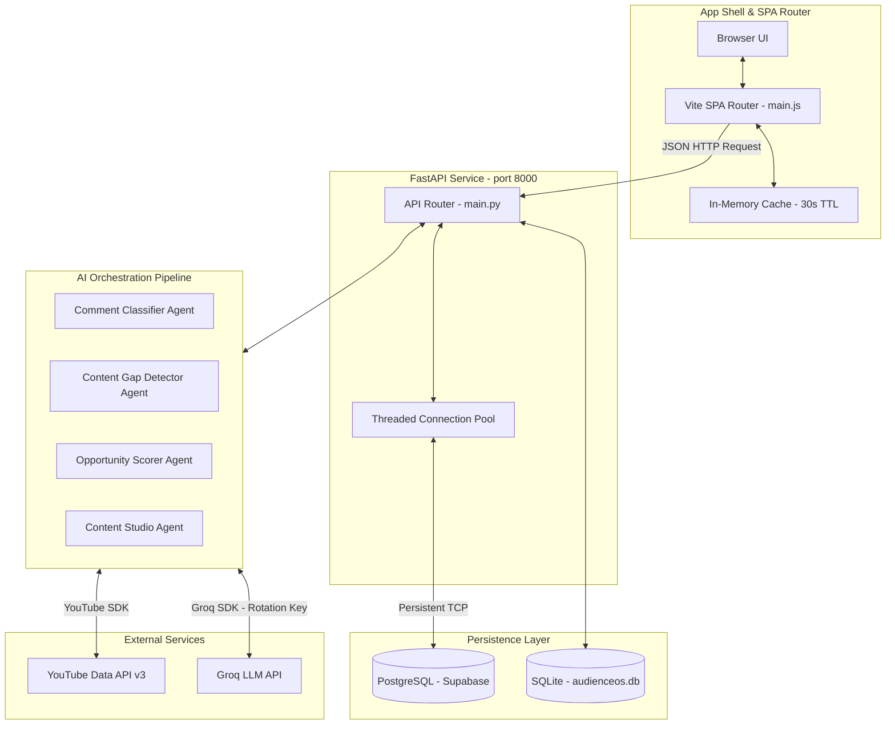
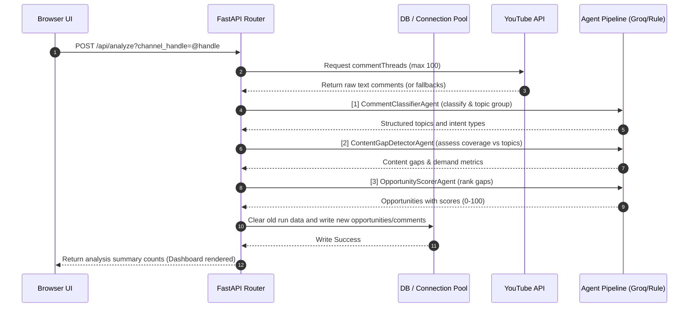

# AudienceOS

AudienceOS is a local, production-grade content-intelligence workspace and AI generation engine for YouTube creators. It bridges the gap between raw audience signals (comments, questions, complaints) and production-ready script/metadata generation. 

By analyzing real-world viewer comments via the YouTube Data API, AudienceOS categorizes viewer sentiment, extracts content gaps, scores priority opportunities, and generates complete, multi-platform publication packages (YouTube scripts with visual directions, LinkedIn posts, and X threads) in a high-density, editorial-monochrome interface.

---

## 🏗️ System Architecture & Data Flow

AudienceOS is built on a decoupled architecture containing a modern vanilla JavaScript Single Page Application (SPA) on the frontend and an asynchronous FastAPI agent runner on the backend, persisting data to either local SQLite or a remote PostgreSQL instance (e.g., Supabase).

### System Topology



---

## ⚡ Technical Performance Optimizations (The "Under the Hood" Details)

AudienceOS has been engineered to eliminate typical latencies associated with remote LLMs and database servers. Below are the specific technical implementations that make the application fast:

### 1. Database Round-Trip Minimization via SQL JSON Aggregation
When using a remote database (such as a Supabase instance in Tokyo, AP-Northeast-1), the network latency can add 300ms–400ms per query. Sequentially executing 7 queries for the dashboard page would ordinarily take upwards of **2 seconds**.
* **The Solution:** For PostgreSQL environments, AudienceOS utilizes advanced JSON queries (`json_build_object` and `json_agg`) to fetch, join, aggregate, and count data from `channels`, `opportunities`, `comments`, and `topics` tables in **one single database round-trip**.
* **Execution Performance:** This database-side packaging reduces dashboard API response times from **~1.7s to under 400ms**.

```sql
SELECT json_build_object(
  'channel', (SELECT json_agg(t) FROM (SELECT * FROM channels LIMIT 1) t),
  'opportunities', (SELECT json_agg(t) FROM (SELECT * FROM opportunities ORDER BY score DESC LIMIT 5) t),
  'recent_comments', (SELECT json_agg(t) FROM (SELECT * FROM comments ORDER BY id DESC LIMIT 5) t),
  'top_topics', (SELECT json_agg(t) FROM (SELECT * FROM topics ORDER BY opportunity DESC LIMIT 5) t),
  'total_comments', (SELECT COUNT(*) FROM comments),
  'total_topics', (SELECT COUNT(*) FROM topics),
  'high_priority', (SELECT COUNT(*) FROM opportunities WHERE score >= 80)
) AS dashboard_data;
```

### 2. Thread-Safe PostgreSQL Connection Pooling
* **The Solution:** Rather than opening and tearing down raw TCP/SSL connections on every incoming request—which adds up to **16 seconds** of handshake overhead from remote regions—`database.py` spins up a thread-safe `psycopg2.pool.ThreadedConnectionPool` at startup.
* Connections are retrieved instantly, and calling `conn.close()` is intercepted by a custom wrapper class (`PostgresConnection`) to release the connection back to the pool rather than severing the socket.

### 3. Frontend App Shell & Flicker-Free Navigation
* **Flicker Mitigation:** When navigating to a cached view, the router checks the cache *before* touching the DOM. It bypasses loading skeletons completely if data is ready, preventing visual flickers.
* **Component-Scoped Icon Rendering:** Scanning the entire DOM via `lucide.createIcons()` causes high scripting/layout overhead. AudienceOS scopes icon updates using `replaceIcons({ root: container })` only on updated container fragments.
* **Compositing & Scroll Optimizations:** Disabled global CSS `backdrop-filter: blur(12px)` and heavy repeating background grid paint vectors. Additionally, scroll-snapping programmatically defaults to `instant` to bypass inertia-based delays.

---

## 🤖 The Multi-Agent Content Pipeline

AudienceOS uses a sequence of four discrete agents (orchestrated via `backend/main.py`) to process audience data:



### 1. Comment Classifier Agent (`comment_classifier.py`)
* **Role:** Parses incoming comments into structured datasets.
* **Taxonomy:** Classifies comments into five intent categories:
  * `QUESTION`: Specific technical queries or queries for advice.
  * `REQUEST`: Explicit requests for tutorials, code, or comparisons.
  * `CONFUSION`: Users stuck on a step or reporting bug symptoms.
  * `FEEDBACK`: Praise, criticism, or corrections.
  * `IDEA`: Feature suggestions or creative concepts.
* **Fallback:** Matches regex keywords (`how to`, `stuck`, `error`, `tutorial`, `vs`) to categorize intents if Groq is offline.

### 2. Content Gap Detector Agent (`gap_detector.py`)
* **Role:** Detects demand trends.
* **Dynamic Gap Evaluation:** Analyzes topic density and uses comment-type distributions to evaluate creator coverage. For instance, a topic with a high percentage of `CONFUSION` and `QUESTION` comments relative to overall volume indicates a **Low Coverage / High Confusion** gap.
* **LLM Engine:** Grouping, demand trends, and coverage scores are run using `llama-3.3-70b-versatile`.

### 3. Opportunity Scorer Agent (`opportunity_scorer.py`)
* **Role:** Scores content opportunities.
* **Mathematical Rubric:** Prioritizes opportunities using:
  $$\text{Opportunity Score} = \text{Demand} \times 0.8 + (\text{Comment Count} \times 4) - \text{Coverage Penalty}$$
  *(Coverage Penalties: High = 30 points, Medium = 15 points, Low = 0 points)*
* **LLM Output:** Refines scored clusters into specific content titles and descriptions explaining the exact value proposition based on interactions and mention-growth rates.

### 4. Content Studio Agent (`content_generator.py`)
* **Role:** Generates full, production-ready scripting assets.
* **Contextual Injectors:** Receives the opportunity details, the channel handle, name, and the **20 most relevant audience comments** containing the exact phrasing and questions asked by viewers.
* **Outputs Generated:**
  * **Curated Titles:** Evaluates three title strategies (Curiosity Gap, Myth-Busting, and 100-Hour Challenge).
  * **Target Hook:** Directly calls out the viewer pain points extracted from comments.
  * **Video Script:** A 1,500-to-2,500-word structured guide with timestamps, visual cues (`[B-ROLL]`, `[SCREEN RECORDING]`), and formatted code snippets.
  * **Social Media Copy:** A platform-optimized YouTube description, an engaging LinkedIn post, and a high-value X thread.

---

## 🛠️ Run Locally

### Prerequisites
* **Python 3.12+**
* **Node.js 18+**

### 1. Environment Setup
Create `backend/.env` at the root of the repository:

```env
YOUTUBE_API_KEY=your_youtube_data_api_v3_key
GROQ_API_KEY=your_groq_api_key

# Optional: Fine-grained key rotation to prevent API rate limits
GROQ_API_KEY_CLASSIFIER=
GROQ_API_KEY_GAP_DETECTOR=
GROQ_API_KEY_SCORER=
GROQ_API_KEY_GENERATOR=

# Optional: Remote Postgres Connection URI (e.g. Supabase)
# Leave blank to fall back automatically to local sqlite (backend/audienceos.db)
DATABASE_URL=
```

### 2. Run the Full Stack
You can start the frontend and backend in one command using the launcher script:

```bash
chmod +x start.sh
./start.sh
```

Alternatively, you can run them in separate terminals:

#### Start Backend
```bash
cd backend
python3 -m venv .venv
source .venv/bin/activate
pip install -r requirements.txt
uvicorn main:app --host 0.0.0.0 --port 8000 --reload
```
* **API Documentation:** `/docs` (FastAPI Swagger UI)

#### Start Frontend
```bash
cd frontend
npm install
npm run dev
```
* **Frontend Web App:** `http://localhost:5173`

---

## ⚙️ Operating Modes

AudienceOS degrades gracefully depending on the API keys provided:

| Environment Keys | Processing Behavior | Result |
| :--- | :--- | :--- |
| **No Keys Configured** | Reads fallback comments from memory; utilizes deterministic local parser rules & rich fallback templates. | **Fully Functional Demo Mode** with mock and offline AI capabilities. |
| **`YOUTUBE_API_KEY` Only** | Pulls up to 100 live comments from the designated YouTube handle; classifies and generates using local fallback templates. | **Live Data with Structured Templates**. |
| **`GROQ_API_KEY` Only** | Uses offline mock comment datasets; runs full AI classification, gap analysis, opportunity ranking, and custom scripts. | **AI Agents with Static Offline Data**. |
| **Both Keys Configured** | Fetches live comments; runs all agents through Groq. | **Production Mode** (Full live context loops). |
