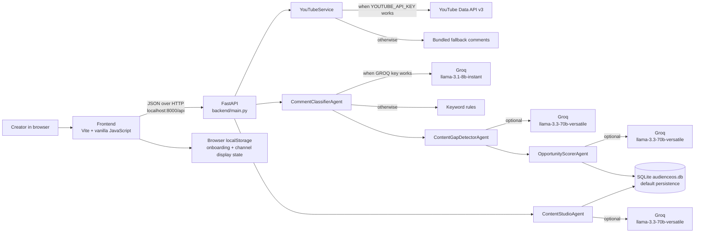
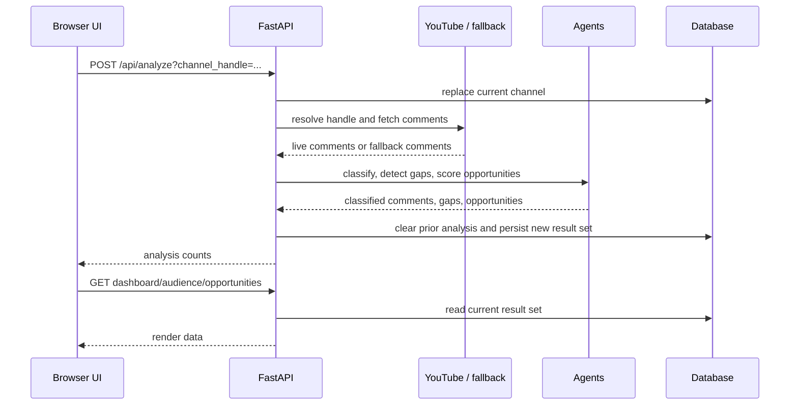
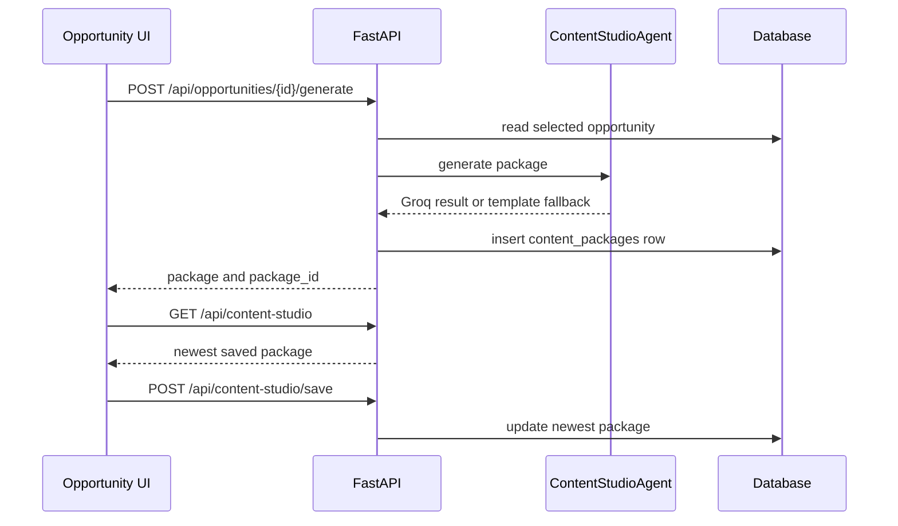
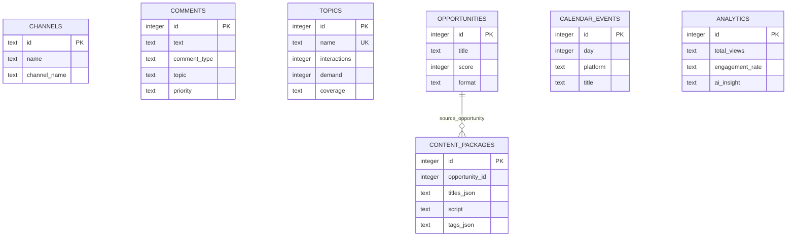

# AudienceOS

AudienceOS is a local full-stack content-intelligence workspace for YouTube creators. It imports a channel's top-level comments (or a built-in fallback set), classifies audience intent, groups demand into content gaps, ranks opportunities, and generates a multi-platform content package.

The project is a Vite single-page application backed by FastAPI. It runs without API keys using deterministic fallback data; YouTube and Groq keys enable live comment retrieval and LLM-generated analysis/content respectively.

## What it does

1. Connect a channel handle or URL from onboarding, dashboard, or settings.
2. Fetch up to 100 top-level channel comments with YouTube Data API v3 when a valid key and resolvable channel are available; otherwise use eight bundled sample comments.
3. Classify each comment as `QUESTION`, `REQUEST`, `CONFUSION`, `FEEDBACK`, or `IDEA`.
4. Aggregate non-general topics, compare them with a fixed channel-coverage list, and calculate demand/coverage gaps.
5. Rank gaps into content opportunities.
6. Generate and save a content package: titles, hook, script, description, tags, Short, LinkedIn post, and X thread.

## Architecture



### Analysis sequence



### Content-generation sequence



## Repository map

```text
.
├── README.md                         This project reference
├── start.sh                          Convenience launcher for both servers
├── backend/
│   ├── __init__.py                   Python package marker
│   ├── main.py                       FastAPI app, routes, orchestration
│   ├── database.py                   SQLite/PostgreSQL connection and schema/seeding
│   ├── requirements.txt              Python dependencies
│   ├── agents/
│   │   ├── __init__.py               Package marker
│   │   ├── comment_classifier.py     Comment intent/topic classifier
│   │   ├── gap_detector.py           Topic aggregation and coverage-gap detector
│   │   ├── opportunity_scorer.py     Opportunity ranking/scoring agent
│   │   └── content_generator.py      Content package generator
│   └── services/
│       ├── __init__.py               Package marker
│       └── youtube_service.py        YouTube handle resolution/comment retrieval
└── frontend/
    ├── index.html                    Vite HTML entry; CDN Lucide icons
    ├── package.json                  Node scripts and dependencies
    ├── package-lock.json             Locked npm dependency tree
    ├── public/
    │   ├── favicon.svg               Vite favicon
    │   └── icons.svg                 Reusable social/documentation SVG symbols
    └── src/
        ├── main.js                   SPA state, render shell, navigation, event wiring
        ├── api/client.js             Hard-coded REST client (localhost:8000/api)
        ├── data/demo.js              UI fallback data and chart series
        ├── assets/
        │   ├── hero.png              Unreferenced image asset
        │   ├── javascript.svg        Unreferenced Vite starter asset
        │   └── vite.svg              Unreferenced Vite starter asset
        ├── pages/
        │   ├── onboarding.js         First-run/connect flow markup
        │   ├── dashboard.js          KPIs, re-analysis, opportunities, signals
        │   ├── audience.js           Classified comment list and filter UI
        │   ├── opportunities.js      Opportunities and topic table
        │   ├── opportunity-detail.js Opportunity evidence/detail view
        │   ├── content-studio.js     Generated-package editor/save interaction
        │   ├── calendar.js           Dynamic month view and YouTube scheduling controls
        │   ├── analytics.js          Metrics and SVG chart views
        │   └── settings.js           Channel/profile preferences view
        └── styles/
            ├── design-system.css     Theme tokens: color, type, spacing, layout
            ├── reset.css             Reset, base elements, focus/scrollbar styles
            ├── layout.css            App shell, sidebar/topbar, responsive layout
            └── components.css        Controls, cards, pages, charts, overlays
```

## Frontend

The frontend uses no framework/router library. `main.js` holds the current page, rerenders the entire `#app` region, and exposes navigation helpers on `window`. Navigation is in-memory; refreshing returns to the dashboard. The first-run state and display channel state are stored in browser `localStorage` under `aos_onboarded`, `aos_channel_name`, `aos_channel_handle`, and `aos_channel_avatar`.

| View | Primary data source | Current behavior |
|---|---|---|
| Onboarding | `POST /api/analyze` | Connects a handle or opens demo mode. The selected analysis-range card is visual only; requests always use `Last 30 days`. |
| Dashboard | `GET /api/dashboard` | Renders current persisted KPIs, top opportunities, comments, and a data-driven topic-demand chart. |
| Audience | `GET /api/audience` | Renders classified comments and counts; category tabs and text search filter the comment list in the browser. |
| Opportunities | `GET /api/opportunities` | Lists ranked opportunities and topic metrics; filter tabs are presentational. |
| Opportunity detail | `GET /api/opportunities/{id}` | Shows one opportunity and the five newest comments (not topic-scoped evidence). |
| Content Studio | `GET/POST /api/content-studio` | Edits and saves the YouTube title, hook, script, description, and tags for the newest package. |
| Calendar | `GET/POST /api/calendar`, `POST /api/calendar/auto-schedule` | Schedules YouTube planning events, displays them on a dynamic month view, and can choose the next free weekday at 10:00 AM. |
| Analytics | `GET /api/analytics` | Displays backend metrics/insight with static demo chart series and topic/format bars. |
| Settings | `POST /api/settings`, `POST /api/analyze` | Saves display name/handle or starts a new analysis. Preference selects are not persisted. |

If a frontend API call fails, `api/client.js` returns `null` and pages use `demo.js` where that page provides a fallback. The backend base URL is currently fixed at `http://localhost:8000/api`.

## Backend and agents

### Analysis pipeline

| Stage | Module | Live behavior | Fallback behavior |
|---|---|---|---|
| Comment source | `services/youtube_service.py` | Resolves `@handle`, URL, or 24-character `UC...` id then requests YouTube `commentThreads` (max 100 top-level comments). | Eight bundled technology comments. |
| Classification | `agents/comment_classifier.py` | Groq `llama-3.1-8b-instant` returns structured comment records. | Keyword intent rules and topic matching. |
| Gap detection | `agents/gap_detector.py` | Groq `llama-3.3-70b-versatile` receives comments plus four fixed existing-video titles. | Counts non-`General` topics; coverage is based on those same fixed titles. |
| Scoring | `agents/opportunity_scorer.py` | Groq `llama-3.3-70b-versatile` returns ranked opportunity JSON. | `demand × 0.8 + topic count × 4 − coverage penalty`, clamped to 50–99. Coverage penalty: High=30, Medium=15, Low=0. |
| Content package | `agents/content_generator.py` | Groq `llama-3.3-70b-versatile` returns package JSON. | Template titles, hook, script, description, tags, Short, LinkedIn, and X copy. |

Classifier fallback topic matching recognizes AI Agents, MCP, RAG, FastAPI, Ollama, and LangChain; anything else is `General`. Groq failures are caught per agent and fall back to deterministic behavior where implemented.

### Persistence model

`backend/database.py` initializes SQLite at `backend/audienceos.db` by default. Set `DATABASE_URL` to use PostgreSQL, including Supabase. Once `DATABASE_URL` is set, the backend fails clearly if it cannot connect rather than quietly writing data to a local SQLite file. Calendar events are stored with the active YouTube channel handle, so schedules from one channel are not shown when another channel is analyzed.



The `opportunity_id` column is logical rather than an enforced foreign key. `analytics` is defined but not read by the current analytics endpoint.

## API reference

All routes are served by `backend/main.py`. Interactive FastAPI/OpenAPI docs are available at `/docs` while the backend is running.

| Method | Route | Purpose |
|---|---|---|
| GET | `/api/health` | Backend status response. |
| GET | `/api/dashboard` | Channel, dynamic KPI array, five highest-scoring opportunities, five newest comments, and five top topics. |
| POST | `/api/analyze?range_type=Last%2030%20days&channel_handle=@name` | Runs the full analysis pipeline. It deletes all comments, topics, opportunities, and packages before saving the result. |
| GET | `/api/audience` | All comments plus intent counts. The counts include hard-coded baseline values in addition to stored comments. |
| GET | `/api/opportunities` | All opportunities ordered by score and all topics ordered by opportunity. |
| GET | `/api/opportunities/{opp_id}` | One opportunity or `404`, plus the five newest comments. |
| POST | `/api/opportunities/{opp_id}/generate` | Generates and persists a content package for one opportunity or returns `404`. |
| GET | `/api/content-studio` | The most recently saved content package, or `{ "package": null }`. |
| POST | `/api/content-studio/save` | Updates the newest package, or creates a package if none exists. Required JSON: `titles`, `selected_title_index`, `hook`, `script`, `description`, `tags`. |
| GET | `/api/calendar` | Calendar events plus the latest generated content title. |
| POST | `/api/calendar` | Saves an internal YouTube scheduling event from `title` and ISO `scheduled_date`. |
| POST | `/api/calendar/auto-schedule` | Saves the title in the next free weekday at 10:00 AM, searching 60 days ahead. |
| GET | `/api/analytics` | Currently returns hard-coded metrics and AI insight. |
| GET | `/api/settings` | First channel record. |
| POST | `/api/settings` | Upserts the `c1` channel with `{ "name", "channel_name" }`. |

## Run locally

### Requirements

- Python 3.12+ recommended
- Node.js 18+ recommended
- Optional: YouTube Data API v3 key
- Optional: Groq API key

### Configure environment

Create `backend/.env` (do not commit secrets):

```env
YOUTUBE_API_KEY=your_youtube_data_api_key
GROQ_API_KEY=your_groq_api_key
GROQ_API_KEY_CLASSIFIER=
GROQ_API_KEY_GAP_DETECTOR=
GROQ_API_KEY_SCORER=
GROQ_API_KEY_GENERATOR=
DATABASE_URL=
```

### Use Supabase as the online database

1. Create a Supabase project, then open **Connect** → **Direct connection** and copy its PostgreSQL URI.
2. Add it to `backend/.env` (keep this file private):

```env
DATABASE_URL=postgresql://postgres.<project-ref>:YOUR_PASSWORD@db.<project-ref>.supabase.co:5432/postgres?sslmode=require
```

3. Restart the backend. It creates the required tables automatically. Do not use the Supabase anon key in this backend; the backend connects with the database URI.

For a serverless host that cannot maintain direct PostgreSQL connections, use Supabase’s pooler URI instead. Keep the connection string only in the host’s secret/environment-variable settings.

The content generator also recognizes `GROQ_API_KEY_2`; the classifier also recognizes `GROQ_API_KEY_1`.

### Start the backend

```bash
cd backend
python3 -m venv .venv
source .venv/bin/activate
pip install -r requirements.txt
uvicorn main:app --host 0.0.0.0 --port 8000 --reload
```

Backend: `http://localhost:8000`
OpenAPI docs: `http://localhost:8000/docs`

### Start the frontend

In another terminal:

```bash
cd frontend
npm install
npm run dev
```

Frontend: `http://localhost:5173`

### Convenience launcher

At repository root, `start.sh` activates a root-level `.venv`, kills processes on ports 8000/5173 and matching `uvicorn`/`vite` processes, starts `uvicorn backend.main:app`, then starts Vite. Review that behavior before using it in a shared environment:

```bash
./start.sh
```

## Operating modes

| Configuration | Result |
|---|---|
| No keys | Fully usable demo/fallback pipeline; results are derived from bundled comments/templates. |
| `YOUTUBE_API_KEY` only | Requests live YouTube top-level comments when the channel resolves; classification, gaps, scoring, and package use rules/templates. |
| `GROQ_API_KEY` only | Uses fallback comments but asks Groq to classify, detect gaps, rank, and generate copy. |
| Both keys | Uses live YouTube comments and Groq agents when API calls succeed. |

## Current implementation boundaries

- No authentication, user isolation, rate limiting, server-side authorization, or production deployment configuration exists. CORS allows all origins.
- The API client is local-host-only; configure `frontend/src/api/client.js` to deploy elsewhere.
- Analysis is synchronous and overwrites the prior analysis dataset and all content packages. There is no job queue or analysis history.
- YouTube retrieval does not paginate, does not use `range_type` to filter, and imports only top-level comment threads. Empty/error responses select the fallback dataset.
- Channel coverage is compared against four static titles, not the selected channel’s actual video catalog.
- PostgreSQL/Supabase is supported through `DATABASE_URL`. This app is still single-user: add authentication and Row Level Security before exposing it publicly to multiple creators.
- Calendar schedules internal planning events only; it does not upload or publish to YouTube. Analytics is static. Some settings preferences are visual-only.
- Content package title/tag fields are JSON strings at the database boundary and decoded by `GET /api/content-studio`.
- UI rendering interpolates API data directly into HTML; treat external comment content as untrusted until output escaping is added.

## Development notes

- Run `npm run build` in `frontend/` to validate the Vite production bundle.
- Run `python -m compileall backend` to catch Python syntax/import compilation issues.
- Delete `backend/audienceos.db` only when intentionally resetting persisted local data; startup will recreate and seed it.

## Dependencies

Frontend: Vite 8 and `lucide-static` (with Lucide loaded from CDN in `index.html`).
Backend: FastAPI, Uvicorn, Pydantic, HTTPX, python-dotenv, Groq SDK, psycopg2-binary, and SQLAlchemy. SQLAlchemy is listed but is not used by the current source.
